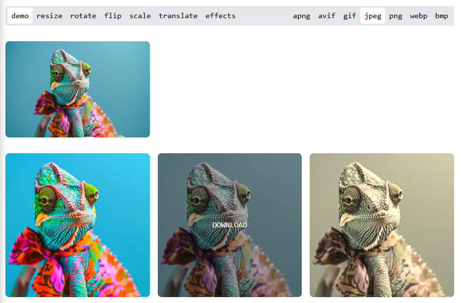

## Example App

The development repository includes an example application built with React. It provides a complete demonstration of all
the features available in the library. This example is designed to quickly showcase and test functionalities, as well as
generate downloadable images with various effects and transformations.



To download and run the example application, execute the following commands:

```shell
git clone git@github.com:svaraborut/webimg.git
cd webimg
npm ci
npm run dev
```
